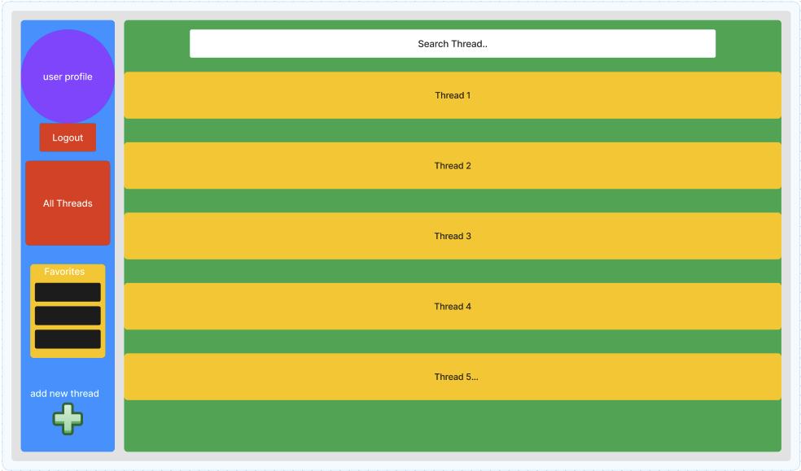
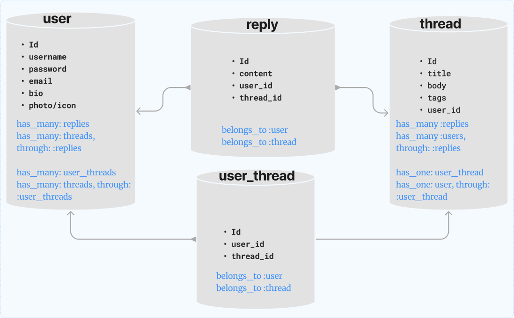
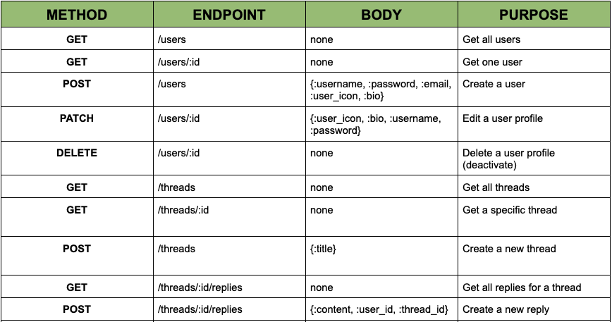
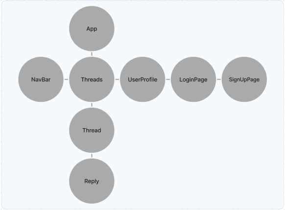

# Dog Forum Application

A forum commuminity for all breeds of dog owners and dog lovers. PupHub allows users to create an account, customize their profile, and create and reply to community discussions about anything related to dogs.

# PupHub homepage wireframe

# Database models

* A user has many replies and has many threads through replies
* A reply belongs to a user and belongs to a thread
* A thread has many replies, has many users through replies, and has one user_thread
* A user_thread belongs to a user and belongs to a thread

# Validations

* User validates 
  * presence of email, username, password
  * uniqueness of email and username
  * format of email with VALID_EMAIL_REGEX
  * username length { minimum: 2}
  * bio length { maximum: 500 }
  * password length { in: 6..20 }

* Thread validates
  * presence of title
  * length of title { maximum: 500 }
  * presence of body
  * length of body { minimum: 1 }

* Reply validates
  * presence of content

# API Endpoints
 
 

# React Component Tree

 

# Stretch Goals

* Live chat functionality
* Friends list
* Multimedia file sharing

# Technologies used

* Ruby
* Ruby on Rails
* Active Record
* React
* JavaScript
* TailwindCSS
* Active Model Serializer
* Hirb
